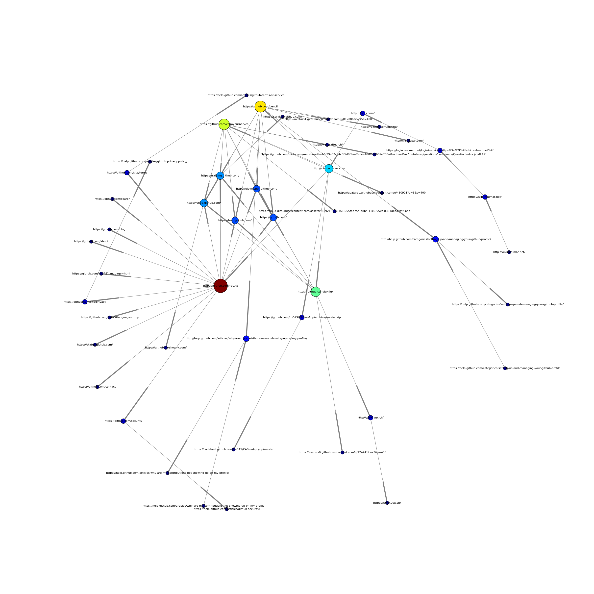

URLCrawler Example
------------------
This is a small example of an urlcrawler. What is does is, start from the URLs defined in `urls.conf`, follow the redirects, filter all the `href`s and then do all this over again with the new urls. The data is stored in a directed graph and then visualized using a force directed graph. (without edge coloring)

Here a cool example image:

License
-------
> crawls URLs and visualize the chain in a directed graph
> Copyright (C) 2017 Anastassios Martakos
>
> This program is free software: you can redistribute it and/or modify
> it under the terms of the GNU General Public License as published by
> the Free Software Foundation, either version 3 of the License, or
> (at your option) any later version.
>
> This program is distributed in the hope that it will be useful,
> but WITHOUT ANY WARRANTY; without even the implied warranty of
> MERCHANTABILITY or FITNESS FOR A PARTICULAR PURPOSE.  See the
> GNU General Public License for more details.
>
> You should have received a copy of the GNU General Public License
> along with this program.  If not, see <http://www.gnu.org/licenses/>.
